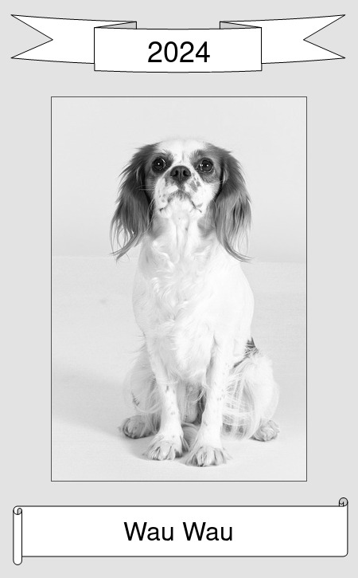

# Tribute

Skript zum Erstellen gerahmter Bilder mit Überschrift und Titel




## Voraussetzungen
Linux PC mit [ImageMagick](https://imagemagick.org/).
```
sudo apt install imagemagick
```

## Verwendung
```
./create "Überschrift" "Titel" "Bilddatei"
```

Zum Beispiel:
```
./create "2024" "Wau Wau" doc/wau_wau.jpg
```


# Font

If you get a warning like `convert-im6.q16: unable to read font `URW-Palladio-L-Bold' ...` 
you may need to install the missing font manually.

Opttion 1:

```
sudo apt-get install gsfonts
```

Option 2:

```
wget https://raw.githubusercontent.com/reinaldoc/atius/refs/heads/master/source/atius-web/src/main/webapp/resources/css/fonts/urw-palladio-l-bold.ttf
sudo mv urw-palladio-l-bold.ttf /usr/share/fonts/truetype/
sudo fc-cache -f -v
```


Afterwards the following check should give a positive output:

```
fc-list : family style | grep URW
```

A further way to list the fonts in your system is:

```
convert -list font
```
